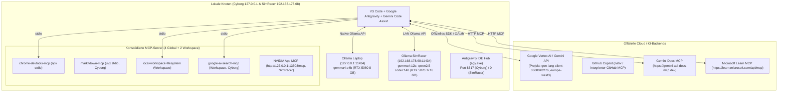

> **Thema:** Konsolidierte MCP-Server, Ollama (`:11434`), Port-Architektur &amp; Archiv entfernter Proxy-Altlasten in VS Code
> **Autor:** Michael Stürmer
> **Datum:** 23.11.2026 *(Altlasten-Abgleich &amp; Konsolidierung)*

<details>
<summary><b>Lernziele</b></summary>

* Die **ToS-konforme Hybrid-Architektur** verstehen: Lokale LLM-Inferenz über **Ollama (`:11434`)** auf `VanstrikeCyborg` und `SimRacer` sowie offizielle Cloud-SDKs (`google-genai`, `@google/genai`, Vertex AI ADC) und lokale/remote **MCP-Server**.
* Die **aktuelle Port-Zuordnung** sicher beherrschen (**`11434`** Ollama, **`8317`** legitimer Google Antigravity IDE Hub `agy.exe`, **`13508`** NVIDIA App MCP, **`8080`** StrikerPi Pitwall Hub).
* Die **bereinigte MCP-Single-Source-of-Truth** (`4` globale Server in `User/mcp.json` + `2` exklusive Workspace-Server in `.vscode/mcp.json`) von den am **23.11.2026 entfernten Proxy-Altlasten** (`CLIProxyAPI`, `llm-gateway` `:8420`, `mcp_proxy.js`) abgrenzen und typische MCP-Fehler diagnostizieren können.

</details>

<details>
<summary><b>Kernkonzepte</b></summary>

<details>
<summary>1.1 Aktuelle Architektur: Ollama (:11434), offizielle SDKs &amp; konsolidierte MCP-Server (Stand: 23.11.2026)</summary>

In der bereinigten Entwicklungsumgebung auf `VanstrikeCyborg` und `SimRacer` greifen lokale GPUs, offizielle Cloud-APIs und verschlankte MCP-Werkzeuge direkt ohne inoffizielle Drittanbieter-Proxys ineinander:


```mermaid
flowchart TD
    subgraph Cloud ["Offizielle Cloud / KI-Backends"]
        GEM["Google Vertex AI / Gemini API<br/>(Projekt: gen-lang-client-0668043276, europe-west3)"]
        COP["GitHub Copilot (nativ / integrierter GitHub-MCP)"]
        GDOCS["Gemini Docs MCP (https://gemini-api-docs-mcp.dev)"]
        MSDOCS["Microsoft Learn MCP (https://learn.microsoft.com/api/mcp)"]
    end

    subgraph Localhost ["Lokale Knoten (Cyborg 127.0.0.1 &amp; SimRacer 192.168.178.68)"]
        VSC["VS Code + Google Antigravity + Gemini Code Assist"]
        OLL_L["Ollama Laptop (127.0.0.1:11434)<br/>gemma4:e4b (RTX 5060 8 GB)"]
        OLL_S["Ollama SimRacer (192.168.178.68:11434)<br/>gemma4:12b, qwen2.5-coder:14b (RTX 5070 Ti 16 GB)"]
        AGY["Antigravity IDE Hub (agy.exe)<br/>Port 8317 (Cyborg) / 0 (SimRacer)"]

        subgraph MCP ["Konsolidierte MCP-Server (4 Global + 2 Workspace)"]
            CDT["chrome-devtools-mcp (npx stdio)"]
            MKD["markitdown-mcp (uvx stdio, Cyborg)"]
            FS["local-workspace-filesystem (Workspace)"]
            GSEARCH["google-ai-search-mcp (Workspace, Cyborg)"]
            NV["NVIDIA App MCP (http://127.0.0.1:13508/mcp, SimRacer)"]
        end
    end

    VSC <-->|"Native Ollama API"| OLL_L
    VSC <-->|"LAN Ollama API"| OLL_S
    VSC <-->|"Offizielles SDK / OAuth"| GEM
    VSC <-->|"HTTP MCP"| GDOCS
    VSC <-->|"HTTP MCP"| MSDOCS
    VSC -->|"stdio"| CDT
    VSC -->|"stdio"| FS
    VSC -->|"stdio"| GSEARCH
```

</details>

<details>
<summary>1.2 Aktuelle Ports &amp; bereinigte MCP-Konfigurationsdateien (Single Source of Truth)</summary>

| Port / Typ | Dienst / Komponente | Host / Protokoll | Zweck &amp; Aktueller Status (23.11.2026) |
| :--- | :--- | :--- | :--- |
| **Port `11434`** | **Ollama Server (`ollama.exe`)** | `127.0.0.1` (Cyborg) &amp; `0.0.0.0` (SimRacer) | Primärer lokaler &amp; LAN-LLM-Endpunkt (`gemma4:e4b`, `gemma4:12b`, `qwen2.5-coder:14b`) als Ersatz für alle entfernten Proxy-Gateways. |
| **Port `8317`** | **Google Antigravity Hub (`agy.exe`)** | `127.0.0.1` (Cyborg; `0` = dynamisch auf SimRacer) | Legitimer `antigravity.serverPort` der offiziellen `google.google-antigravity` Extension (**nicht** mehr `CLIProxyAPI`). |
| **Port `13508`** | **NVIDIA App MCP (`NvAppMcpServer.exe`)** | `127.0.0.1` HTTP (`/mcp`) | Auf SimRacer aktiv in Global `mcp.json`; auf Cyborg entfernt (dort `0` aktive Tools). |
| **Port `8080`** | **StrikerPi Pitwall Hub (`telemetry_relay.py`)** | `192.168.178.86` HTTP / WS | Live-Telemetrie, Lobby-Streams, Sandbox-Steuerung, **Agenten &amp; Light Steuerungskonsole** + **Antigravity Sprachchat-Button**. |
| **HTTPS Remote** | **Gemini Docs (`geminiDocs`) &amp; Microsoft Learn** | Streamable HTTP | Globale Referenz-MCP-Server in `User\mcp.json` auf beiden Knoten. |
| **`stdio` Lokal** | **`chrome-devtools`, `markitdown`, `local-workspace-filesystem`, `google-ai-search-mcp`** | Standard I/O (`npx` / `uvx`) | `chrome-devtools` (+ `markitdown` auf Cyborg) global; `local-workspace-filesystem` &amp; `google-ai-search-mcp` exklusiv im Workspace. |

### Konsolidierte Speicherorte der MCP-Konfigurationen (Stand: 23.11.2026):
1. **VS Code Global User-MCP (`VanstrikeCyborg`):** `C:\Users\strik\AppData\Roaming\Code\User\mcp.json` (`4` Server: `geminiDocs`, `microsoft-learn`, `chrome-devtools`, `markitdown`)
2. **VS Code Global User-MCP (`SimRacer`):** `C:\Users\Mike\AppData\Roaming\Code\User\mcp.json` (`4` Server: `geminiDocs`, `microsoft-learn`, `chrome-devtools`, `nvidia-app`)
3. **VS Code Workspace-MCP (`git-labor`):** `C:\Users\strik\git-labor\.vscode\mcp.json` (`2` Server: `local-workspace-filesystem`, `io.github.shariqriazz/google-ai-search-mcp`)
4. **VS Code Workspace-MCP (`ac-sandbox` auf SimRacer):** `C:\ac-sandbox\.vscode\mcp.json` (`1` exklusiver Server: `local-workspace-filesystem`)
5. **Bereinigte / geleerte Alt-Dateien:** `git-labor\.mcp.json` (`{ "mcpServers": {} }`), `assetto-corsa-content\.vscode\mcp.json` (`{ "servers": {} }`), keine `"mcp"`-Dubletten mehr in `git-labor.code-workspace`, `assetto-corsa-content.code-workspace` oder `simracer.code-workspace`.

</details>

<details>
<summary>1.3 Fallstudie: NVIDIA App MCP-Server Timeout (Fehlercode <code>-2147467259</code>)</summary>

* **Symptom:** Beim Aktivieren von *„Agent-Zugriff“* in der NVIDIA App springt der Schalter nach ~10 Sekunden mit `MCP server did not become ready in time` zurück.
* **Ursache:** Der Dienst `NvContainerLocalSystem` hatte wegen eines verwaisten Plugin-Ordners aufgehört, das Verzeichnis `C:\Program Files\NVIDIA Corporation\NvContainer\plugins\AIUser` zu überwachen. Dadurch wurde `McpServerPlugin.dll` nicht geladen und die Named Pipe `\\.\pipe\nvidia-nvapp-mcp-server-...` fehlte.
* **Schnellbehebung &amp; Prüfung:**
  ```powershell
  # 1. NVIDIA Container-Dienst neu starten
  Restart-Service NvContainerLocalSystem

  # 2. Prüfen, ob die Named Pipe aktiv ist oder Port 13508 lauscht
  [System.IO.Directory]::GetFiles("\\.\\pipe\\") | Where-Object { $_ -match "nvapp-mcp" }
  Get-NetTCPConnection -LocalPort 13508 -State Listen -ErrorAction SilentlyContinue
  ```

</details>

<details>
<summary>1.4 Fallstudie: <code>github-mcp-server</code> nativ / Copilot-integriert statt über Docker betreiben</summary>

* **Symptom:** `open //./pipe/dockerDesktopLinuxEngine: The system cannot find the file specified.`
* **Ursache:** Der `github-mcp-server` war früher als Docker-Container (`docker run ... ghcr.io/github/github-mcp-server`) konfiguriert. Wenn Docker Desktop nicht läuft, schlägt der Start sofort fehl.
* **Aktuelle Lösung:** In VS Code läuft GitHub MCP direkt integriert über `github.copilot.chat.githubMcpServer.enabled: true` (`lockdown: true`, `readonly: true`); für externe CLI-Clients startet `C:\Users\strik\.local\bin\github-mcp-server.exe` nativ über `stdio` mit ~25 MB RAM statt 2–4 GB für Docker Desktop.

</details>

<details>
<summary>1.5 🗄️ Archiv: Entfernte Altlasten – <code>CLIProxyAPI</code>, <code>llm-gateway</code> &amp; Port-8000-Kollision ([ENTFERNT am 23.11.2026])</summary>

> [!NOTE]
> **Status: `[ENTFERNT / ARCHIVIERT – 23.11.2026]`** — Die folgenden Komponenten wurden vollständig aus VS Code, Workspaces und Startskripten entfernt (ToS-Compliance &amp; Übergang zu nativem Ollama `:11434`). Dieser Abschnitt dient nur noch der historischen Fehler-Referenz.

* **`CLIProxyAPI` (`cli-proxy-api.exe`) auf `:8317` und `github.copilot.llm-gateway.serverUrl` (`:8317` / `:8420`):** Durch Ollama (`:11434`) sowie offizielle Cloud-Provider (`google-genai`, Vertex AI ADC, offizielle Extensions) ersetzt. Alle zugehörigen Keys (`antigravityCopilot.*`, `llm-gateway.*`, `acpHub.*`, `oaicopilot.models`, `customLlm.models`) sowie **`mcp_proxy.js`** und insgesamt **26** Proxy-/Wrapper-Extensions (`settingsSync.ignoredExtensions`) wurden entfernt und blockiert.
* **Historische Fallstudie (`Unexpected token '&lt;'` bei Port `8000` vs. `8317`):** Tratt auf, wenn ein früheres LLM-Gateway fälschlicherweise `http://localhost:8000` (HTML-UI) statt einer JSON-REST-API abfragte. Prüfbefehl für Portkonflikte heute:
  ```powershell
  Get-NetTCPConnection -LocalPort 11434,8317,13508 -State Listen -ErrorAction SilentlyContinue | Format-Table LocalAddress, LocalPort, State, OwningProcess
  Invoke-RestMethod -Uri "http://127.0.0.1:11434/api/tags"
  ```

</details>

</details>

<details>
<summary><b>Übungsaufgaben</b></summary>

1. **Ollama vs. Cloud-Endpunkt prüfen:** Verifiziere mit `Invoke-RestMethod http://127.0.0.1:11434/api/tags` und `http://192.168.178.68:11434/api/tags`, welche Modelle lokal vs. im LAN aktiv sind.
2. **Single Source of Truth prüfen:** Kontrolliere, warum alle globalen MCP-Server zentral in `AppData\Roaming\Code\User\mcp.json` liegen und nicht mehr in jeder `.code-workspace`-Datei dupliziert werden.
3. **MCP-Neustart:** Über welchen Befehl in der VS Code Befehlspalette (`Strg + Shift + P`) kannst du alle aktiven MCP-Server auflisten, deren Logs einsehen und einen Server gezielt neu starten (`MCP: List Servers`)?

</details>

<details>
<summary><b>Weiterführende Links &amp; Quellen</b></summary>

* [Model Context Protocol (MCP) Offizielle Spezifikation](https://modelcontextprotocol.io/)
* [VS Code Copilot MCP Server Dokumentation](https://code.visualstudio.com/docs/copilot/chat/mcp-servers)
* [Gemini Docs MCP Server (`gemini-api-docs-mcp.dev`)](https://aistudio.google.com/docs/coding-agents#mcp-setup)
* [Ollama REST API Dokumentation](https://github.com/ollama/ollama/blob/main/docs/api.md)

</details>

<details>
<summary><b>Chips &amp; Kernaussagen</b></summary>

* **Ollama `:11434` statt Proxy `:8317`/`llm-gateway`:** Inoffizielle OAuth-/LLM-Gateways sind seit dem **23.11.2026** entfernt und archiviert; lokal rechnet Ollama, in der Cloud das offizielle Google SDK (`Vertex AI ADC`).
* **Single Source of Truth (`4 + 2` MCP-Server):** `4` globale Server in `User/mcp.json`, exklusive Repo-Server in `.vscode/mcp.json` — keine Dubletten in `.code-workspace` oder `.mcp.json`.
* **Port `8317` gehört `agy.exe` (`antigravity.serverPort`):** Auf Cyborg fest auf `8317`, auf SimRacer dynamisch (`0`), auf beiden als legitimer Antigravity IDE Hub.
* **NVIDIA MCP läuft über `AIUser`-Container:** Fehlt die Named Pipe oder Port `13508`, behebt `Restart-Service NvContainerLocalSystem` den blockierten Watchdog.

</details>

---
*Hinweis zur Organisation:* Die erstellte Dokumentation ist am Drehlaufwerk abgelegt und mit einer kurzen Zusammenfassung von den Chips auch in den Notebooks verlinkt.

<!-- DOKU-MINIMAP-START -->
<style>
.doku-arch-flow { font-family: var(--vscode-editor-font-family, Consolas, monospace); background: rgba(20, 24, 33, 0.92); border: 1px solid rgba(100, 140, 220, 0.35); border-radius: 10px; padding: 14px 16px; margin: 10px 0; color: #e2e8f0; }
.doku-arch-root { text-align: center; font-weight: 700; font-size: 1.04em; padding: 8px 12px; margin-bottom: 12px; background: linear-gradient(135deg, rgba(37, 99, 235, 0.28), rgba(15, 23, 42, 0.9)); border: 1px solid rgba(96, 165, 250, 0.5); border-radius: 8px; }
.doku-arch-root a { color: #93c5fd !important; text-decoration: none !important; }
.doku-arch-root a:hover { text-decoration: underline !important; }
.doku-arch-grid { display: grid; grid-template-columns: repeat(auto-fit, minmax(275px, 1fr)); gap: 10px; }
.doku-arch-card { background: rgba(30, 41, 59, 0.78); border: 1px solid rgba(148, 163, 184, 0.28); border-left: 4px solid #3b82f6; border-radius: 8px; padding: 9px 11px; transition: transform 0.12s ease, border-color 0.12s ease; }
.doku-arch-card:hover { border-color: #60a5fa; transform: translateY(-1px); }
.doku-arch-card.r1 { border-left-color: #22c55e; }
.doku-arch-card.r2 { border-left-color: #3b82f6; }
.doku-arch-card.r3 { border-left-color: #eab308; }
.doku-arch-card.r4 { border-left-color: #ec4899; }
.doku-arch-card.r5 { border-left-color: #a855f7; }
.doku-arch-card-title { font-weight: 700; font-size: 0.95em; margin-bottom: 6px; padding-bottom: 4px; border-bottom: 1px dashed rgba(148, 163, 184, 0.25); }
.doku-arch-card-title a { color: #f8fafc !important; text-decoration: none !important; display: block; }
.doku-arch-card-title a:hover { color: #60a5fa !important; }
.doku-arch-lines { list-style: none; margin: 0; padding: 0; font-size: 0.85em; line-height: 1.5; }
.doku-arch-lines li { margin: 3px 0; padding: 2px 5px; border-radius: 4px; white-space: normal; }
.doku-arch-lines li:hover { background: rgba(59, 130, 246, 0.18); }
.doku-arch-lines a { color: #cbd5e1 !important; text-decoration: none !important; display: inline; }
.doku-arch-lines a:hover { color: #93c5fd !important; text-decoration: underline !important; }
.doku-arch-badge { display: inline-block; font-size: 0.75em; padding: 0 5px; margin-left: 4px; border-radius: 4px; background: rgba(59, 130, 246, 0.22); color: #93c5fd !important; border: 1px solid rgba(96, 165, 250, 0.35); }
details.doku-minimap { position: fixed; bottom: 18px; right: 18px; z-index: 9999; width: 250px; max-height: 76px; overflow: hidden; background: rgba(15, 23, 42, 0.94); border: 1px solid rgba(96, 165, 250, 0.65); border-radius: 10px; box-shadow: 0 8px 26px rgba(0, 0, 0, 0.65); backdrop-filter: blur(8px); transition: width 0.18s ease, max-height 0.18s ease; font-family: var(--vscode-font-family, sans-serif); }
details.doku-minimap:hover { border-color: #60a5fa; }
details.doku-minimap[open] { width: min(860px, 94vw); max-height: 84vh; overflow-y: auto; padding-bottom: 10px; }
details.doku-minimap > summary { cursor: pointer; list-style: none; padding: 8px 12px; font-weight: 700; font-size: 0.84em; color: #f8fafc; background: linear-gradient(90deg, rgba(37, 99, 235, 0.45), rgba(30, 41, 59, 0.9)); border-bottom: 1px solid rgba(148, 163, 184, 0.25); display: flex; align-items: center; justify-content: space-between; user-select: none; }
details.doku-minimap > summary::-webkit-details-marker { display: none; }
details.doku-minimap .minimap-preview-strip { display: flex; gap: 4px; padding: 5px 10px 7px 10px; font-size: 0.72em; color: #94a3b8; justify-content: space-between; }
details.doku-minimap[open] .minimap-preview-strip { display: none; }
details.doku-minimap .minimap-preview-strip span { background: rgba(30, 41, 59, 0.9); padding: 2px 6px; border-radius: 4px; border: 1px solid rgba(148, 163, 184, 0.25); }
details.doku-minimap .minimap-body { padding: 8px 12px 4px 12px; }
</style>
<details class="doku-minimap">
<summary><span>🗺️ Doku-Minimap (5 Rubriken &amp; Labs)</span><span title="Klicken zum Vergrößern / Einklappen">⛶</span></summary>
<div class="minimap-preview-strip"><span>01 Linux</span><span>02 VSCode</span><span>03 Python</span><span>04 JS/TS</span><span>05 Agents</span></div>
<div class="minimap-body">
<div class="doku-arch-flow">
<div class="doku-arch-root">🏛️ <a href="../README.md">VanstrikeCyborg — git-labor Lern- &amp; Test-Architektur (Doku-Index)</a>  |  <a href="../../README.md">Repo-README</a>  |  <a href="../../AGENTS.md">AGENTS.md</a>  |  <a href="../../notebook-agent-environments/README.md">Notebooks</a></div>
<div class="doku-arch-grid">
<div class="doku-arch-card r1">
<div class="doku-arch-card-title">🐧 <a href="../01_Linux_Bash/README.md">01_Linux_Bash (Linux, Shell &amp; Container)</a></div>
<ul class="doku-arch-lines">
<li>├─ <a href="../01_Linux_Bash/01_bash-grundlagen-und-skripting.md">01 • Bash CLI, Text-Tools, Streams &amp; Expansions</a> <a class="doku-arch-badge" href="../../labs/01_linux_bash/check-env.sh">check-env.sh</a></li>
<li>├─ <a href="../01_Linux_Bash/02_linux-systemadministration-und-interna.md">02 • Inodes, LVM, Prozesse, Boot-Prozess &amp; systemd</a></li>
<li>├─ <a href="../01_Linux_Bash/03_arch-linux-omarchy-und-remote-ssh.md">03 • Arch Linux, Omarchy, Remote-SSH &amp; Nginx</a></li>
<li>├─ <a href="../01_Linux_Bash/04_fortgeschrittenes-bash-skripting-und-automatisierung.md">04 • Advanced Bash: Arrays, getopts &amp; Backups</a></li>
<li>└─ <a href="../01_Linux_Bash/05_docker-und-sbx-micro-vms.md">05 • Docker Grundlagen &amp; Sandbox Micro-VMs (sbx)</a></li>
</ul>
</div>
<div class="doku-arch-card r2">
<div class="doku-arch-card-title">🧩 <a href="README.md">02_VSCode_Env (IDE, Git, MCP &amp; Gemini)</a></div>
<ul class="doku-arch-lines">
<li>├─ <a href="01_vscode-architektur-lsp-und-remote.md">01 • VS Code Architektur, Sprachserver (LSP) &amp; Remote</a></li>
<li>├─ <a href="02_git-github-und-multi-root-workspaces.md">02 • Git, GitHub Workflow &amp; Multi-Root Workspaces</a> <a class="doku-arch-badge" href="../../git-labor.code-workspace">Workspace</a></li>
<li>├─ <a href="03_mcp-server-localhost-proxy-und-ports.md">03 &bull; MCP-Server, Ollama (:11434) &amp; Ports (Archiv: Proxy)</a></li>
<li>└─ <a href="04_gemini-oekosystem-ai-studio-und-api-keys.md">04 • Gemini Ökosystem, Google AI Studio &amp; API-Keys</a></li>
</ul>
</div>
<div class="doku-arch-card r3">
<div class="doku-arch-card-title">🐍 <a href="../03_Python_Coding/README.md">03_Python_Coding (Python, uv &amp; GenAI SDK)</a></div>
<ul class="doku-arch-lines">
<li>├─ <a href="../03_Python_Coding/01_python-setup-uv-venv-und-notebooks.md">01 • Python Setup: uv, .venv, Pylance &amp; Notebooks</a></li>
<li>├─ <a href="../03_Python_Coding/02_gemini-api-python-sdk-und-interactions.md">02 • Google GenAI SDK (google-genai) &amp; Interactions API</a></li>
<li>└─ <a href="../03_Python_Coding/03_python-automatisierung-datenanalyse-und-tests.md">03 • Automatisierung, Datenanalyse &amp; pytest</a> <a class="doku-arch-badge" href="../../labs/03_python/sensor_demo.py">sensor_demo.py</a></li>
</ul>
</div>
<div class="doku-arch-card r4">
<div class="doku-arch-card-title">🌐 <a href="../04_JS_TS_Web/README.md">04_JS_TS_Web (HTML/CSS, JS/TS &amp; Web-SDK)</a></div>
<ul class="doku-arch-lines">
<li>├─ <a href="../04_JS_TS_Web/01_html-css-und-dom-grundlagen.md">01 • HTML5, CSS3 &amp; DOM-Manipulation Grundlagen</a> <a class="doku-arch-badge" href="../../labs/04_js_ts_web/rechner.html">rechner.html</a></li>
<li>├─ <a href="../04_JS_TS_Web/02_modernes-javascript-und-typescript.md">02 • Modernes JavaScript (ES6+) &amp; TypeScript</a></li>
<li>└─ <a href="../04_JS_TS_Web/03_gemini-sdk-typescript-und-web-apps.md">03 • Google GenAI SDK (@google/genai) für Web-Apps</a></li>
</ul>
</div>
<div class="doku-arch-card r5">
<div class="doku-arch-card-title">🤖 <a href="../05_Agents/README.md">05_Agents (KI-Agenten, Skills &amp; Orchestrierung)</a></div>
<ul class="doku-arch-lines">
<li>├─ <a href="../05_Agents/01_agent-stilfibel-und-didaktik-ruler.md">01 • Agent-Stilfibel, Didaktik-Ruler &amp; 7-Stufen-Aufbau</a></li>
<li>├─ <a href="../05_Agents/02_agenten-erstellen-instructions-rules-und-prompts.md">02 • Agenten erstellen: Instructions, Rules &amp; Prompts</a> <a class="doku-arch-badge" href="../../.github/instructions/gemini-api.instructions.md">gemini.instructions</a></li>
<li>├─ <a href="../05_Agents/03_agenten-ausruesten-skills-und-mcp-tools.md">03 • Agenten ausrüsten: Skills (SKILL.md) &amp; MCP-Tools</a> <a class="doku-arch-badge" href="../../.agents/skills/live-transfer-status-monitor/SKILL.md">SKILL.md</a></li>
<li>└─ <a href="../05_Agents/04_agenten-trainieren-primen-und-orchestrieren.md">04 • Agenten trainieren, primen &amp; Multi-Agent-Orchestrierung</a> <a class="doku-arch-badge" href="../../.github/agents/light.agent.md">@light</a> <a class="doku-arch-badge" href="../../.github/agents/rig.agent.md">@rig</a></li>
</ul>
</div>
</div>
</div>
</div>
</details>
<!-- DOKU-MINIMAP-END -->
